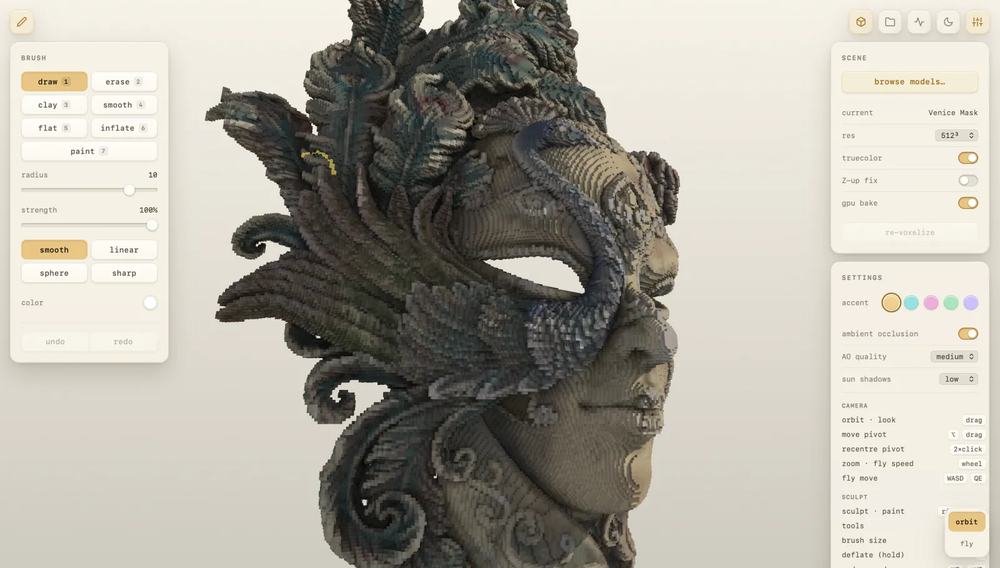

<div align="center">

# Gestalt

**A voxel renderer and editor in Rust + wgpu.**

Turn a 3D model into voxels, then sculpt and paint them in real time —
natively or in the browser.

<p>
  
  
  
  
</p>

<p>
  
</p>

</div>

---

Gestalt voxelizes a triangle mesh — glTF, OBJ, or STL — into a sparse voxel volume
and ray-traces it on the GPU. From there it's an editor: sculpt with brushes
(Draw, Erase, and Clay to build and carve; Smooth, Flatten, and Inflate to shape
the surface), paint per-voxel color, and undo or redo any stroke. The same core
runs as a native viewer and as a WebGPU/WASM app, so it all works in the browser
with nothing to install.

## Architecture

The dependency graph runs strictly **inward** toward a pure, GPU- and IO-free
`voxel-core`; everything effectful — devices, windows, mesh IO — lives at the edges.

| Crate | Role |
| --- | --- |
| **voxel-core** | Pure domain core: the sparse MIP structure, the reference traversal oracle, and the GPU buffer contract. No GPU, no IO. |
| **voxel-gpu** | wgpu adapter: the stackless HDDA compute kernel, held bit-exact against `voxel-core`. |
| **voxelizer** | Conservative surface voxelizer (glTF · OBJ · STL) — a GPU compute path diffed against a CPU SAT oracle. |
| **voxel-brush** | Deterministic sculpt / paint kernels: fields in, voxel operations out. |
| **voxel-camera** | Shared camera math and input snapshot for the front ends. |
| **voxel-viewer** | Native interactive viewer (winit + wgpu surface). |
| **voxel-web** | WASM / WebGPU kernel behind the TypeScript shell in [`web/`](web/). |
| **voxel-cli** | Headless driver: measurement, benchmarking, and the CPU↔GPU differential. |

## Quickstart

```sh
make viewer                    # open the native viewer + editor
make mesh MESH=model.glb       # voxelize a mesh and edit it (glTF · OBJ · STL)
make web                       # build + serve the browser app at localhost:5173
```

Native rendering needs a `wgpu`-capable adapter (Metal / Vulkan / DX12). The web
shell additionally needs [`wasm-pack`](https://rustwasm.github.io/wasm-pack/) and
Node. Run `make help` for the full command catalog.

## License

Dual-licensed under **MIT** or **Apache-2.0**, at your option.
