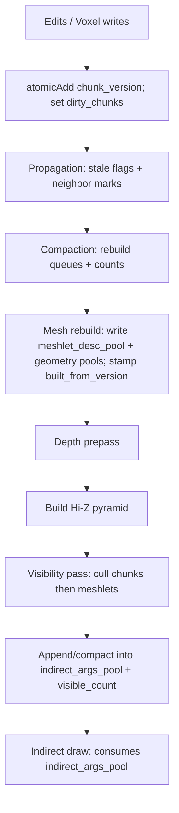
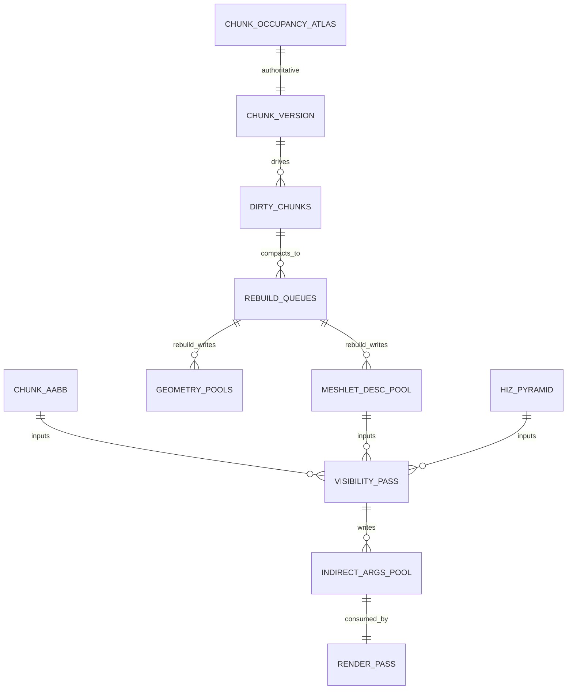

# GPU-Generated Indirect Submission for Meshlets in a Chunked 64³ Voxel Renderer

## Executive summary

A GPU‑native voxel renderer that wants **meshlet/cluster submission without CPU enumeration** almost always uses **indirect execution**—but the *shape* of “indirect” depends on API:

- **Baseline (portable): “indirect argument buffers”**  
  GPU produces an `indirect_args_pool` (and a `visible_count`), CPU records a small, stable command buffer that calls an indirect draw/dispatch. Vulkan provides `vkCmdDraw*Indirect` and the `*IndirectCount` variants where the **draw count comes from a GPU-written buffer**. citeturn14search3turn0search2turn5search5turn24search4  
  D3D12 provides the more expressive `ExecuteIndirect` w/ a command signature and optional count buffer. citeturn2view0turn14search0turn14search6  
  Metal provides indirect draws in multiple ways, but its most “command‑buffer like” mechanism is **Indirect Command Buffers (ICB)** where commands can be encoded on GPU and executed by the render encoder as a single call. citeturn1search0turn24search0turn12search0  

- **Advanced: “GPU-generated command streams / device-generated commands”**  
  Used when **per‑draw state changes** (shader/pipeline, VB/IB bindings, push constants) must also be GPU-chosen. Vulkan now has **multi‑vendor device-generated commands** (`VK_EXT_device_generated_commands`) to generate device-side streams of state + commands without host readback, explicitly to avoid speculative recording or readback when state varies per draw. citeturn11search0turn26search1turn15search3  
  D3D12’s `ExecuteIndirect` is similarly expressive via command signatures. citeturn14search1turn14search7turn2view0  
  Metal ICB is the closest in spirit to “GPU writes commands.” citeturn1search0turn15search2turn24search0  

For your chunked 64³ architecture, the most coherent integration is:

1) Treat `indirect_args_pool` as **per‑frame derived**: built from `chunk_aabb` + Hi‑Z + `meshlet_desc_pool`, then consumed immediately by the render pass using indirect draw count.  
2) Ensure every indirect draw references **stable handles** (slot indices + offsets in pools), not transient pointers.  
3) Prevent stale/racy draws with **`built_from_version` stamps**, `ready_to_swap` bits, and conservative eviction rules that never recycle pool regions or slots until GPU completion fences (or N‑frame ring) guarantee safety.

This is exactly the lineage in production “GPU‑driven rendering pipelines”: GPU culling writes cluster lists and drawcall args, then a small handful of indirect draws execute. citeturn6view0turn2view0turn5search8  

---

## GPU-driven indirect support in modern APIs

### Vulkan

**Portable indirect args**  
Vulkan’s indirect model is fundamentally “CPU records a `vkCmd*Indirect` call; GPU reads parameters from a `VkBuffer` at execution.”  
- `vkCmdDrawIndirect` reads an array of `VkDrawIndirectCommand` structures from a buffer. citeturn14search3turn14search2  
- `vkCmdDrawIndexedIndirect` does the same for indexed draws. citeturn0search2  
- The **critical GPU-driven enabler** is the “Count” variants promoted into Vulkan 1.2 (`VK_KHR_draw_indirect_count`): `vkCmdDrawIndirectCount` / `vkCmdDrawIndexedIndirectCount` read the **draw count** from a GPU buffer at execution time, bounded by `maxDrawCount`. citeturn24search4turn5search5turn24search2  
- Compute can also be GPU-driven via `vkCmdDispatchIndirect`, reading `VkDispatchIndirectCommand` from a buffer. citeturn1search2  

**Mesh shader path**  
If mesh shaders are available, Vulkan exposes mesh-task draws with indirect and indirect-count forms: `vkCmdDrawMeshTasksIndirectEXT` and `vkCmdDrawMeshTasksIndirectCountEXT` (and NV equivalents). citeturn3search2turn27search7turn3search11  
This is the Vulkan-native way to make “one meshlet = one task/mesh workgroup” and cull/expand on GPU.

**Device-generated commands (DGC)**  
When indirect args are insufficient (because you need GPU-driven changes in VB/IB bindings, push constants, shaders/pipelines), Vulkan’s **multi-vendor** `VK_EXT_device_generated_commands` exists explicitly to generate a device-side stream of state changes + commands and convert it into command buffer execution without host readback; it also supports partial stream updates for incremental changes. citeturn11search0turn26search1turn15search3turn15search5  
Key implications:
- DGC introduces a preprocess step/buffer; memory requirements are queriable and preprocessing is synchronized via `VK_PIPELINE_STAGE_COMMAND_PREPROCESS_BIT_EXT`. citeturn15search1turn24search5  
- Executing generated commands can invalidate command buffer state depending on executed tokens—important for pipeline structuring. citeturn28search0turn28search2  

### D3D12

**ExecuteIndirect is the core primitive**  
D3D12’s `ID3D12GraphicsCommandList::ExecuteIndirect` executes a sequence of GPU-read arguments described by an `ID3D12CommandSignature`. citeturn2view0turn14search0  
Important details for integration:
- Count buffer semantics are explicit: actual command count = `min(countBufferValue, MaxCommandCount)` when a count buffer is provided. citeturn2view0  
- The debug layer requires the argument and count buffers be in `D3D12_RESOURCE_STATE_INDIRECT_ARGUMENT`. citeturn2view0turn27search0  
- The command signature format is described by `D3D12_COMMAND_SIGNATURE_DESC` and per-argument descriptors in `D3D12_INDIRECT_ARGUMENT_DESC`. citeturn14search1turn14search7  

**Indirect execution may include hidden preprocessing**  
The DirectX engineering spec notes acceptable implementations include either direct GPU interpretation of the argument buffer or a hidden compute conversion step into a hardware-specific format, potentially hoisted earlier if no barriers prevent it. citeturn27search10turn14search5  
Engineering implication: your indirect argument layout should be stable and aligned, and you should expect some drivers/GPUs to effectively “preprocess” indirect streams.

**Mesh shaders (amplification/mesh pipeline)**  
Mesh shaders are a first-class D3D12 pipeline replacement for VS/GS, and the mesh shader spec explicitly supports indirect dispatch via `D3D12_INDIRECT_ARGUMENT_TYPE_DISPATCH_MESH` in `ExecuteIndirect`. citeturn24search1turn0search0  

### Metal

**Indirect Command Buffers are literally GPU-generated command bundles**  
Metal’s ICB model allows commands to be encoded on CPU or GPU and executed via `executeCommandsInBuffer:withRange:` on a render encoder. citeturn24search0turn1search0  
Key details:
- ICBs can be encoded **on the GPU** by a compute kernel to generate draw calls based on culling results; Apple’s sample explicitly frames this as “generate draw commands only for objects currently visible.” citeturn1search0  
- The GPU-encoding sample shows you pass the ICB via an argument buffer and must call `useResource` on the ICB with write usage, plus optional reset and optimization steps (`resetCommandsInBuffer`, `optimizeIndirectCommandBuffer`). citeturn15search2turn28search3  
- The ICB descriptor `commandTypes` controls what command types are supported, and Apple notes you can’t mix rendering and compute commands in the same indirect command buffer. citeturn12search0  
- The CPU-encoding doc highlights that resources referenced by the ICB must be made visible via `useResource:usage:` and that ICB can inherit pipeline state and other render state from its parent encoder. citeturn24search0turn12search2  

**Bottom line**: Metal has the most literal “indirect command buffer” concept; Vulkan/D3D12 can emulate the same behavior via DGC / ExecuteIndirect when needed, but the portable baseline is still indirect argument buffers + indirect count.

---

## GPU-generated command list construction patterns

This section describes concrete patterns for producing `indirect_args_pool` (or a command stream) from a visibility pass, including synchronization.

### Pattern family overview

| Pattern | How it works | When to use | Costs / risks |
|---|---|---|---|
| Atomic append | Each candidate that passes visibility does `i = atomicAdd(visible_count, 1)` and writes args at `indirect_args_pool[i]` | Easiest, good default | Unstable ordering; contention if millions of candidates |
| Bitmask + prefix-sum compaction | Pass 1 writes `visible_bit[i]`; scan/prefix-sum computes indices; pass 2 scatters visible items densely | When you need stable ordering, binning, or fewer atomics | More passes + scan overhead |
| Multi-bin append (by material/pipeline) | Multiple counters, one per bin; candidates append into bin-specific regions | When you need coarse state sorting without full sort | Fragmentation and bin overflow complexity |
| Sort + compact | Compute key (depth/material); radix sort; then write args | When overdraw is dominant or order matters | Heavy GPU work; careful budgeting |
| GPU-generated command stream (ExecuteIndirect / DGC / ICB) | GPU generates commands/state tokens rather than only draw args | When per-draw state changes must be GPU-chosen | Highest complexity; strict lifetime rules |

#### Why “IndirectCount” matters for voxel meshlets
The portable goal is: **GPU decides how many meshlets are visible** and emits exactly that many draws.  
- Vulkan’s `*IndirectCount` reads the draw count from a GPU buffer at execution time. citeturn24search4turn5search5  
- D3D12 `ExecuteIndirect` reads the command count from a count buffer (min with `MaxCommandCount`). citeturn2view0  
- Metal ICB can encode empty commands for invisible objects, then *optimize* to remove empty/redundant commands. citeturn15search2turn28search3  

### Synchronization semantics (the “don’t get haunted” part)

#### Vulkan: compute writes → indirect read stage
Vulkan’s spec defines the stage where indirect parameters are consumed as `VK_PIPELINE_STAGE_DRAW_INDIRECT_BIT` and explicitly states this stage consumes `VkDrawIndirect*` / `VkDispatchIndirect*` data structures. citeturn27search6turn27search9  
The access mask for indirect reads is `VK_ACCESS_INDIRECT_COMMAND_READ_BIT`, which occurs in the draw indirect stage. citeturn13search3  

**Canonical barrier (conceptual):**
- srcStage: compute shader
- srcAccess: shader write
- dstStage: draw indirect
- dstAccess: indirect command read  
This mapping is consistent with Vulkan’s stage/access definitions. citeturn13search3turn27search6  

If you use Vulkan Synchronization2, the same intent is expressed via `VK_PIPELINE_STAGE_2_DRAW_INDIRECT_BIT` and `VK_ACCESS_2_INDIRECT_COMMAND_READ_BIT`. citeturn28search6turn13search1  

#### D3D12: UAV/compute writes → INDIRECT_ARGUMENT state
D3D12 requires that the argument and count buffers be in `D3D12_RESOURCE_STATE_INDIRECT_ARGUMENT` when used for `ExecuteIndirect`; the debug layer errors otherwise. citeturn2view0turn27search0  
So the “barrier” conceptually is: transition your `indirect_args_pool` (and count buffer) from UAV write / shader-readable to INDIRECT_ARGUMENT before execution.

#### Metal: encoder ordering + explicit resource usage for ICB
Metal’s sample emphasizes declaring resource usage (`useResource`) for the ICB when writing from compute, and then executing it later. citeturn15search2turn24search0  
Within a command buffer, command encoder ordering provides the dependency, but you must still declare resource usage correctly for resources referenced by an ICB. citeturn24search0turn12search2  

---

## Mapping indirect submission onto your 64³ chunk invariants and canonical buffers

Assume canonical buffers:

- `chunk_occupancy_atlas` (authoritative occupancy/voxel words per slot)
- `chunk_aabb` (tight bounds per slot)
- `dirty_chunks` (bitset / control plane)
- `meshlet_desc_pool` (derived surface clusters: bounds, offsets, version tag)
- `indirect_args_pool` (per-frame indirect args + count)

### Architectural fit: chunk → meshlet is a perfect GPU-driven visibility hierarchy
Your chunk structure already gives you two strong culling tiers:

1) **Chunk AABB and flags** (cheap to test, early reject)  
2) **Meshlet bounds** (smaller, reduces “partially visible chunk still expensive”)

This mirrors production GPU-driven pipelines that first cull instances, then expand into clusters and cull clusters (including occlusion and backface proxies), finally writing draw args. citeturn6view0  

### Recommended indirect args structure (API-agnostic)
For maximum portability, define one `IndirectDraw` struct per visible meshlet:

- `indexCount`
- `instanceCount` (usually 1)
- `firstIndex`
- `baseVertex`
- `firstInstance` (can encode meshlet ID / slot ID)

Vulkan’s equivalent indexed indirect command is read from a buffer by `vkCmdDrawIndexedIndirect`. citeturn0search2turn0search3  
D3D12’s `ExecuteIndirect` will interpret an argument buffer per your command signature. citeturn2view0turn14search1  

You can treat `firstInstance` (or a root constant in D3D12 signatures) as the “meshlet handle” to fetch extra per-meshlet metadata in shaders—exactly the “manual vertex fetch / shared buffer” style discussed in the Ubisoft talk’s cluster rendering overview. citeturn6view0  

### Buffer layout tables

#### Control-plane / scheduling buffers (per-frame or frequently updated)
| Buffer | Type | Written by | Read by | Lifetime | Notes |
|---|---|---|---|---|---|
| `dirty_chunks` | bitset | edit kernels | propagation + compaction | persistent | GPU writes via atomics; CPU should not write queues directly (design invariant) |
| `mesh_rebuild_queue` | u32 list | compaction | mesh rebuild pass | per-frame | optional if you already have it |
| `visible_count` | u32 | cull/compact | indirect draw | per-frame | Vulkan `*IndirectCount` / D3D12 count buffer equivalent |
| `indirect_args_pool` | struct array | cull/compact | render pass | per-frame | rebuild every frame; easiest to ring-buffer |

#### Data-plane buffers (persistent, allocator-managed)
| Buffer | Type | Written by | Read by | Lifetime | Notes |
|---|---|---|---|---|---|
| `chunk_occupancy_atlas` | u32 grid per slot | edits / uploads | traversal, summaries | persistent | authoritative |
| `chunk_aabb` | 2×vec4 per slot | summary rebuild | cull pass | persistent | derived but cached |
| `meshlet_desc_pool` | meshlet descriptors | mesh build | cull + shader | persistent | derived; must carry version tagging |
| `vertex_pool`, `index_pool` (implied) | geometry pools | mesh build | raster | persistent | meshlet desc references offsets here |

---

## Edit handling, stale-draw prevention, and eviction/compaction safety

### Preventing stale draws: version stamping as a first-class invariant
A GPU-driven visibility system is fundamentally a **“derived product”** machine (it’s a materialized view, not truth). The main rule is:

> The cull pass must only emit indirect draws for meshlets whose `built_from_version` equals the current `chunk_version` (or a mesh-specific version) and whose slot is resident.

This mirrors the “versioned swap” correctness pattern used in many GPU-driven pipelines and matches the intent of your edit protocol.

### Techniques that work well with indirect submission

**Built-from-version gating**
- `meshlet_desc_pool[i].built_from_version`
- `chunk_version[slot]` (authoritative)
- Cull shader discards meshlets when they mismatch; optionally re-enqueue rebuild.

**Ready-to-swap flags**
- Rebuild passes write `ready_to_swap[slot]=1` when new meshlet data is complete.
- Cull pass ignores “under construction” content to avoid transient corruption.

**Double-buffered meshlet ranges**
If meshlets are rebuilt into a new range, update `meshlet_range_table[slot]` only when safe:
- either after a GPU fence for the last frame that could reference old ranges,
- or by using a 2–3 frame ring of mapping tables and indexing by `frame_id`.

### Indirect command lifetime vs chunk eviction / atlas compaction

The hazard is classic: **in-flight indirect draws reference freed or repurposed memory.** Solutions:

1) **Stable handles for the duration of in-flight frames**  
   Don’t recycle slot IDs or meshlet pages until GPU completion fences indicate no command buffer in flight can reference them.

2) **Indirection through slot tables rather than raw pointers**  
   Indirect commands reference `slot` + `meshlet_id` (or `firstInstance` encodes it). Actual addresses/offsets are fetched from stable tables in GPU memory. This makes compaction/relocation feasible as long as the table update is synchronized.

3) **Avoid moving data that is referenced by ICB/DGC structures without explicit lifecycle control**  
   Vulkan DGC explicitly calls out lifetime constraints for pipelines/shader objects in indirect execution sets. citeturn26search0turn15search3  
   Metal ICB similarly requires explicit resource usage declarations for resources referenced by the ICB. citeturn24search0turn12search2  

---

## Meshlet pool allocator strategies for indirect-driven rendering

Your pool design and edit protocol already cleanly separate control plane and data plane. For meshlets, the allocator question becomes: “how do we keep handles stable across in-flight frames while allowing rebuild churn?”

### Practical allocator options

| Strategy | How it works | Pros | Cons | Best fit |
|---|---|---|---|---|
| Fixed-size pages per slot | Reserve worst-case meshlet storage per slot | Simplest; stable; zero fragmentation | Memory heavy | Early implementation; tight correctness |
| Slab allocator (size classes) | Pools of fixed page sizes; meshlets allocated from matching bin | Stable handles per page; moderate efficiency | Some internal waste; complexity | Medium-term production choice |
| Ring buffer per frame | Allocate transient meshlet geometry each frame | Fast; no free list | Not persistent; unsuitable for chunk meshes unless re-meshing every frame | Visibility-only buffers, not chunk meshes |
| Copy-compact (defrag) | Move meshlets to reduce fragmentation; update mappings | Memory efficient long-term | Hard: requires strict lifetime tracking | Only if fragmentation becomes measured issue |

**Key integration rule:**  
`indirect_args_pool` should be treated as **ephemeral**, so it can safely reference (slot, meshlet index) and never needs long-lived stable addresses. The persistent pieces are `meshlet_desc_pool` and geometry pools.

---

## Debugging, validation, and metrics in a GPU-driven indirect renderer

GPU-driven systems fail in “silent” ways unless you design observability.

### Recommended instrumentation primitives

**Counters (GPU written, optional small readback)**
- `visible_chunk_count`
- `visible_meshlet_count`
- rejection reasons: `culled_frustum`, `culled_hiz`, `culled_empty`, `culled_version_mismatch`

**GPU timestamps**
- cull pass time
- Hi‑Z build time
- draw time

**CRC / hash sampling**
- Periodically compute a lightweight hash across a small subset of `meshlet_desc_pool` and `meshlet_range_table` to detect corruption or racey writes.

**Visual debug views**
- “meshlet ID color” view (color by meshlet index) to spot flicker/stale swaps
- “version mismatch heatmap” (red = attempted draw rejected by version)
- occlusion debug: draw rejected chunks/meshlets in wireframe overlay for one frame

**API validation layers**
- Vulkan: make sure barriers include draw-indirect stage/access when indirect args are written by compute, based on stage/access definitions. citeturn27search6turn13search3  
- D3D12: rely on debug layer enforcement that indirect argument buffers are in `D3D12_RESOURCE_STATE_INDIRECT_ARGUMENT`. citeturn2view0turn27search0  
- Metal: ensure `useResource` coverage for resources referenced by ICBs. citeturn24search0turn15search2  

---

## Pros, cons, and difficulty

### Pros
- **CPU cost collapses**: CPU records a small, stable command buffer; GPU decides what to draw using indirect count buffers or ICB/DGC. citeturn24search4turn2view0turn1search0  
- **Scales to huge candidate sets**: chunk count and meshlet count become “data size,” not “CPU submission cost.”
- **Natural fit to chunk architecture**: chunks are already an “instance list”; meshlets act as “cluster list.”

### Cons
- **Allocator + lifetime complexity moves to center stage** (especially when you also do GPU-side edits and pool reuse).
- **Debugging gets harder**: correctness depends on careful synchronization and version gating.
- **Portability ceiling**: Metal ICB / Vulkan DGC / D3D12 ExecuteIndirect differ in expressivity; the portable core is still indirect args + bindless-like resource access.

### Difficulty assessment
- **Indirect args + indirect count**: medium (mostly careful sync + buffer design).  
- **ExecuteIndirect / ICB / Vulkan DGC**: high (expressive but more stateful and more ways to mismanage lifetimes). citeturn26search1turn24search0turn2view0  
- **Mesh shaders**: high and platform-dependent; they require meshlet toolchain refactors and feature availability checks. citeturn0search0turn3search11  

---

## Minimal reference implementation plan for your engine

This assumes your existing pipeline stages conceptually match:

- R-2 depth prepass  
- R-3 Hi‑Z pyramid build  
- R-4 occlusion cull + indirect arg write  
- R-5 color pass  

(You already have these on paper; this is the minimal “make it real” skeleton.)

### Passes and sync points

**Pass A: Edit / dirty marking (as needed)**
- Write `chunk_occupancy_atlas`, bump `chunk_version`, atomically set `dirty_chunks`.

**Pass B: Propagate + compact (per frame, if dirty)**
- Produce rebuild queues; optionally prepare `dispatchWorkgroupsIndirect` args.

**Pass C: Mesh rebuild (dirty chunks only)**
- Update `meshlet_desc_pool` + geometry pools for changed slots.
- Write `mesh_version[slot]`, `ready_to_swap[slot]`.

**Pass D: Depth prepass (R-2)**
- Draw previous frame’s “known good” geometry (or current if ready).

**Pass E: Hi‑Z build (R-3)**
- Build `hiz_pyramid`.

**Pass F: Visibility + indirect args build (R-4)**
- For each resident `slot`:
  - quick reject using `chunk_flags` / empty
  - frustum test using `chunk_aabb`
  - Hi‑Z test using `hiz_pyramid`
  - if chunk survived: iterate meshlets in `meshlet_range_table[slot]`
    - version gate: `meshlet.built_from_version == chunk_version[slot]`
    - meshlet Hi‑Z test
    - append to `indirect_args_pool` and increment `visible_count`

**Pass G: Main color pass (R-5)**
- One call: execute indirect draws from `indirect_args_pool` up to `visible_count`.

### Failure modes to explicitly guard
- **Use-after-free**: meshlet pages freed while in-flight `indirect_args_pool` refers to them.
- **Slot reuse aliasing**: slot evicted and reused in same “in-flight window.”
- **Stale draws**: cull pass emitted draws with mismatched versions (should be gated).
- **Barrier bugs**: missing compute→draw-indirect visibility barrier (Vulkan), missing resource state transition (D3D12), missing `useResource` for ICB resources (Metal). citeturn13search3turn27search0turn24search0  

---

## Comparison table: CPU-submitted vs GPU indirect vs mesh-shader amplification

| Model | Submission mechanism | What GPU decides | Pros | Cons | Best when |
|---|---|---|---|---|---|
| CPU-submitted draws | CPU records `drawIndexed` per chunk | Almost none | Simpler debugging | CPU overhead, poor scaling | Small scenes, early prototypes |
| GPU-generated indirect draws | GPU writes `indirect_args_pool` + `visible_count`; CPU records one/few indirect draw calls | Visibility + count | Portable across Vulkan/D3D12; scales | Needs careful sync + versioning | Your chunked voxel world; monolithic pipeline state |
| Mesh-shader amplification | GPU writes mesh-task dispatch args; draw via mesh pipeline (`DispatchMesh` / `vkCmdDrawMeshTasks*`) | Visibility + amplification + per-meshlet generation | Can reduce VB/IB bandwidth; tighter cull/expand | Feature availability; toolchain refactor; hard debugging | High-end platforms; heavy meshlet workloads |

Mesh shaders explicitly require refactoring geometry into meshlets and support indirect dispatch in D3D12. citeturn0search0turn24search1turn3search11  

---

## Mermaid diagrams

### Pipeline flow (edit → dirty → compact → indirect args → draw)

### Buffer ownership / dependency graph

---

## Safe implementation checklist (short)

- **Indirect buffers are per-frame**: allocate `indirect_args_pool` as a ring, reset `visible_count` each frame.
- **Version gate everything**: never emit indirect draws for meshlets whose `built_from_version != chunk_version[slot]`.
- **Make lifetimes explicit**:
  - don’t recycle slots or meshlet pages until GPU fence for the last referencing frame completes
  - keep a small “in-flight frames” index window and per-frame free lists
- **Correct sync**:
  - Vulkan: barrier to `DRAW_INDIRECT` stage with `INDIRECT_COMMAND_READ` access after compute writes. citeturn27search6turn13search3  
  - D3D12: transition indirect buffers to `D3D12_RESOURCE_STATE_INDIRECT_ARGUMENT`. citeturn2view0turn27search0  
  - Metal: ensure `useResource` coverage for ICB and referenced buffers; consider optimize/reset flows. citeturn15search2turn24search0  
- **Add observability early**: counters + meshlet ID debug view before optimizing.

---

### Practical answer to the “do we need indirect command buffers?” question

For a GPU-native voxel renderer, the **portable, likely-correct default** is:

- **Yes** to GPU-generated **indirect args + indirect count** (Vulkan `*IndirectCount`, D3D12 `ExecuteIndirect` with count buffer). citeturn24search4turn2view0turn5search5  
- **Maybe** to full indirect “command buffers” (Metal ICB, Vulkan DGC) if you truly need GPU to choose **state changes** per draw beyond what your bind model can encode. citeturn1search0turn11search0turn26search1  

For your chunk/meshlet voxel world—where you can often keep one pipeline and index/vertex pools with bindless-style lookups—**indirect args are usually sufficient**, and “indirect command buffers” become an optional escalation path rather than a prerequisite.