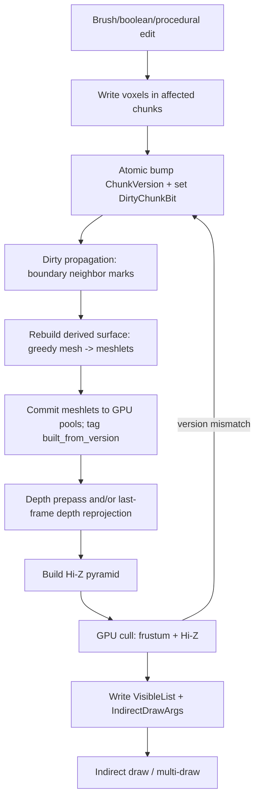
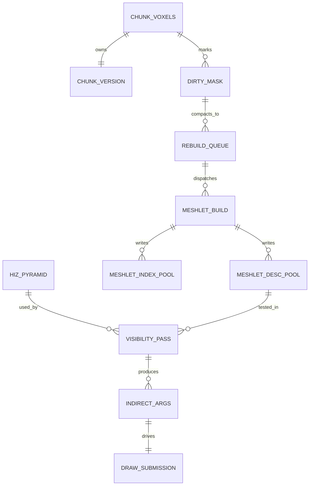

# Nanite-like Virtualized Geometry for Voxel Engines

## Executive summary

“Nanite philosophy” is not “triangles vs voxels.” It is a system-level stance: **virtualize geometry into small clusters, stream the working set, and do per-frame cluster selection (LOD + occlusion + backface/proxy) predominantly on the GPU** so that cost trends toward “work ∝ visible pixels,” not “work ∝ total scene triangles.” citeturn6search0turn3search1turn3search2

Voxel engines already contain several of Nanite’s enabling invariants: **regular spatial partitioning (chunks/subchunks), strong empty-space structure, cheap occupancy summaries, and locality under edits.** The main missing piece (in most voxel renderers) is **fine-grained, GPU-driven visibility selection above the mesher**, so that *occluded or subpixel surfaces are not submitted and shaded* even if they exist in mesh form. citeturn3search1turn3search2

Best prior art that directly applies Nanite-like thinking to voxel/volume data includes:

- **GigaVoxels**: “ray-guided streaming” that couples rendering with **view/occlusion‑dependent adaptive hierarchy and demand-driven data production**—a direct analogue of “visibility drives residency.” citeturn7view2  
- **Efficient Sparse Voxel Octrees (ESVO)**: compact GPU-friendly sparse surface-voxel structure; discusses contour information and practical ray casting on GPUs. citeturn7view3  
- **GVDB** and **NanoVDB**: GPU-oriented sparse volume data structures using pooled/linearized layouts and hierarchical traversal metadata; especially relevant for **pool allocation, update semantics, and debugging/validation constraints** in GPU-resident worlds. citeturn7view4turn7view5  
- **Aokana (2025)**: explicitly builds a **GPU-driven voxel rendering pipeline** that includes **Hi‑Z occlusion culling** and a multi-pass compute pipeline to reduce overdraw—very close in spirit to Nanite’s “GPU decides visibility.” citeturn5view1turn5view0  

For your architecture (64³ padded chunks, `opaque_mask` u64 columns, palette materials, greedy chunk meshes), the “native integration” path that avoids bolt-ons is:

1) **GPU-driven chunk/subchunk visibility + indirect draws** (frustum + Hi‑Z),  
2) **subchunk meshlets (surface clusters) built from greedy meshes** for better granularity,  
3) **persistent GPU pools + versioned rebuild queues** for editability and low CPU↔GPU chatter.

**Prioritized sources (copyable links)**  
```text
Nanite docs (Epic): https://dev.epicgames.com/documentation/en-us/unreal-engine/nanite-virtualized-geometry-in-unreal-engine
Nanite deep dive (SIGGRAPH 2021 slides PDF): https://advances.realtimerendering.com/s2021/Karis_Nanite_SIGGRAPH_Advances_2021_final.pdf
GPU-driven culling/indirect pipeline (Ubisoft, SIGGRAPH 2015): https://advances.realtimerendering.com/s2015/aaltonenhaar_siggraph2015_combined_final_footer_220dpi.pdf
Hierarchical Z-buffer visibility (Greene et al. 1993): https://www.cs.princeton.edu/courses/archive/spring01/cs598b/papers/greene93.pdf
GigaVoxels (INRIA): https://www-sop.inria.fr/reves/Basilic/2009/CNLE09/
ESVO (NVIDIA): https://research.nvidia.com/sites/default/files/pubs/2010-02_Efficient-Sparse-Voxel/laine2010i3d_paper.pdf
GVDB (Eurographics/Hpg 2016): https://diglib.eg.org/bitstream/handle/10.2312/hpg20161197/109-117.pdf
NanoVDB (SIGGRAPH 2021 Talks): https://research.nvidia.com/labs/prl/nanovdb/nanovdb2021.pdf
Aokana (arXiv): https://arxiv.org/abs/2505.02017
Meshlet generation strategies (JCGT 2023): https://jcgt.org/published/0012/02/01/paper-lowres.pdf
```

## Survey of research, talks, and implementations that map Nanite ideas to voxels/volumes

### Nanite as a reference model (clusters, virtualization, GPU selection)
Official documentation frames Nanite as a **virtualized geometry system** with an internal format and specialized rendering technology aimed at extremely high detail and object counts. citeturn0search0turn0search8  
A widely referenced SIGGRAPH course talk (“Deep Dive into Nanite”) describes the end-to-end pipeline including **building, streaming, culling, rasterizing, and shading** of its mesh-based structure. citeturn9view0turn6search0

**Voxel takeaway:** the transferable parts are not “microtriangles,” but (a) **small clusters with bounds**, (b) **hierarchical occlusion**, (c) **GPU-driven worklists/indirect submission**, and (d) **streaming/page residency**.

### Sparse voxel hierarchies and demand-driven streaming (voxel-native “virtualization”)
**GigaVoxels (Crassin et al.)** is one of the most directly “Nanite-like” voxel systems: it emphasizes **adaptive representation depending on view and occlusion**, **ray-casting**, **temporal coherence**, and crucially **guiding data production/streaming from information extracted during rendering**. citeturn7view2turn2search13  
This is essentially “visibility-driven residency” applied to voxels.

**Efficient Sparse Voxel Octrees (Laine & Karras)** focuses on voxels as feature-rich geometry on GPUs, presenting a compact structure and fast ray casting; it also introduces contour information that improves resolution/compactness and can accelerate casts. citeturn7view3turn0search5  
The extended technical report explicitly mentions the renderer detecting missing data and signaling a CPU streaming path—an explicit instance of a **feedback loop between traversal and streaming** (akin to virtualized resources). citeturn4search3turn0search5

### GPU-resident sparse volume “databases” (pool allocators, traversal metadata, update semantics)
**GVDB** proposes a GPU voxel database for sparse hierarchies of grids and emphasizes **indexed memory pooling design for dynamic topology** and **hierarchical traversal for efficient GPU ray tracing**. citeturn7view4turn0search3  
For “fully GPU-driven scheduling,” GVDB is valuable not because you will copy it, but because it demonstrates what becomes central once the GPU owns the structure: **pool allocators, compact indices, traversal metadata, and careful update pathways**.

**NanoVDB** provides a sparse volume structure portable across GPU/graphics APIs and discusses the challenge of balancing computational and memory efficiency in sparse volumetric structures; it is used in practice in multiple tools and supports real-time GPU use cases. citeturn7view5turn1search5  
NanoVDB is best read as a sobriety pill: GPU-friendly layout helps, but **editability (especially topology changes) dominates engineering complexity** once you want dynamic worlds.

### Compression and deduplication (storage efficiency vs editability)
**Sparse voxel DAGs** compress voxel scenes by merging identical subtrees (octree → DAG) and can be extremely compact, but structural sharing makes fine-grained edits harder to localize without copy-on-write and careful invalidation. citeturn1search3turn1search15  
This is “Nanite-like” on the storage axis (virtualized memory footprint), but often hostile to real-time editing unless you deliberately constrain edits or implement localized COW semantics.

### GPU-driven voxel rendering pipelines in recent literature
**Aokana (2025)** is directly on point: it proposes a GPU-driven voxel rendering framework for open-world games using **SVDAG + LOD + streaming**, and it describes a **GPU-driven rendering pipeline** with passes including chunk selection, tile selection, ray marching, and building Hi-Z; it explicitly states that the pipeline uses **Hi‑Z occlusion culling and a visibility buffer to decrease overdraw** and references the Ubisoft GPU-driven rendering pipeline as inspiration. citeturn5view1turn5view0  

### Foundational occlusion and GPU-driven submission references
- **Hierarchical Z-buffer visibility** combines object-space subdivision and an image-space Z pyramid to quickly reject hidden geometry, exploiting object/image/temporal coherence. citeturn7view7turn3search2  
- The **Ubisoft GPU-driven rendering pipeline** (SIGGRAPH course) is a canonical staged pattern: instance culling (frustum/occlusion) → cluster expansion → cluster culling → index compaction → multi-draw/indirect submission. citeturn7view6turn3search1  

These two are the “Nanite-adjacent primitives” that voxel engines can adopt without changing voxel storage.

## Technique catalog mapped to your chunked 64³ padded-column world

Below, “suitability” is evaluated specifically for: **64³ padded chunks, `opaque_mask[x*64+z]` u64 columns, palette materials, greedy mesher chunk meshes**, and real-time edits.

### Subchunk clustering and meshlets for voxel surfaces

**What it is:** Convert your per-chunk greedy mesh into **smaller clusters** (meshlets), each with tight bounds (AABB/sphere) and optionally a “normal cone” proxy for conservative backface-ish culling. Meshlet research shows generation strategy affects rendering performance and cluster utilization. citeturn3search0turn3search8  

**Pros:**  
It reduces triangle setup and/or pixel shading by rejecting occluded/offscreen clusters earlier than chunk-level culling. In voxel scenes with large chunks partially visible, this is often the difference between “one big occluded chunk still costs a lot” and “most of it doesn’t render.”

**Cons / complexity:**  
Requires new persistent buffers: meshlet descriptors + meshlet index ranges + (possibly) vertex pulling tables. Meshlet builders must balance spatial locality, vertex reuse, and material coherence; “bad meshlets” expand screen-space bounds and reduce culling effectiveness. citeturn3search0turn3search8  

**Editability:**  
Excellent if meshlets are derived per dirty chunk/subchunk and rebuilt lazily. You can unify this with your existing versioning model (mesh built from version N).  

**Fit to your layout:**  
Very good. Your core spatial unit (64³) naturally decomposes into 8³ or 16³ subchunks; even if greedy quads span large areas, meshlets can be forced to stay within subchunk boundaries for predictable rebuild cost.

### Cluster BVHs (two-level: per chunk and/or global)

**What it is:** Build a BVH over clusters (meshlets or subchunks). Use it for frustum culling, occlusion candidate ordering, and ray queries (picking/probes). BVH-like bounding hierarchies are the natural generalization of both octrees (in voxel land) and cluster hierarchies (in Nanite-like renderers). citeturn7view7turn7view3  

**Pros:**  
Improves culling efficiency by hierarchical early-outs. Can unify raster culling and ray traversal if you reuse bounds.

**Cons / complexity:**  
BVH maintenance under edits is non-trivial. The pragmatic approach is: **rebuild BVH per dirty chunk** (cheap because chunk meshlet count is limited), or **refit bounds** then occasionally rebuild.

**Fit to your layout:**  
If you already store per-subchunk “occupied bounds” or meshlet bounds, BVH build per dirty chunk is straightforward and local, preserving your chunk isolation invariants.

### Hi-Z / occlusion pyramids for chunk and subchunk culling

**What it is:** Build a depth pyramid from a depth prepass (and/or reproject previous frame), then test bounds against the hierarchical Z. This family of techniques is a proven way to reduce hidden work and is explicitly designed to exploit coherence. citeturn7view7turn7view6  

**Pros:**  
Directly targets your stated pain: **reducing overdraw and “drawn but invisible” triangles**. Chunk-level Hi-Z is an immediate win; subchunk/meshlet Hi-Z provides the second step.

**Cons / complexity:**  
Needs careful conservatism to avoid false occlusion (missing geometry). Temporal stabilization (using previous frame visibility) is powerful but increases the complexity of correctness and debugging. Greene’s work emphasizes coherence exploitation and combining approaches. citeturn7view7turn3search2  

**Fit to your layout:**  
Excellent. Your world is naturally chunked; chunk AABBs are stable; subchunk AABBs are integer-grid-aligned; depth tests are cheap and GPU-friendly.

### GPU-driven worklists and indirect draw pipelines

**What it is:** GPU builds the “visible list” and writes **indirect draw args**, so CPU only updates uniforms and kicks a few passes. This is the core “GPU-driven philosophy” used in modern engines and explicitly documented in production pipeline talks. citeturn7view6turn3search1  

**Pros:**  
- Minimal CPU overhead; scales to huge chunk counts.  
- Eliminates CPU↔GPU sync for visibility lists.  
- Makes “clusterization later” easier because the scheduling pattern remains stable.

**Cons / complexity:**  
Harder debugging: you need buffer inspection, counters, validation passes, and clear ownership/versioning protocols.

**Fit to your layout:**  
Very good. You can treat each chunk (or meshlet) as an “instance” in the Ubisoft pipeline and incrementally refine the granularity over time. citeturn7view6turn3search1  

### Editable hierarchical structures (SVOs, SVDAGs, NanoVDB/GVDB-like pools)

**What it is:** Store the world (or far-field) in a sparse hierarchy like SVO/SVDAG or VDB-like tree, optionally with brick pools.  

**Pros:**  
- Natural empty-space skipping and LOD.  
- Unified structure for ray effects and potentially direct rendering.  
- Demonstrated at scale in GigaVoxels and ESVO. citeturn7view2turn7view3  

**Cons / complexity:**  
- Updates require topology maintenance; GPU pool allocators and fragmentation become core engineering. GVDB explicitly introduces indexed memory pooling for dynamic topology. citeturn7view4  
- DAG-based compression can be hostile to edits because shared subtrees couple distant regions. citeturn1search3turn1search15  

**Fit to your layout:**  
Best as a **secondary representation** (far-field, LOD clipmap, or ray-tracing structure) rather than replacing your chunk truth, unless you are prepared to redesign the edit pipeline around hierarchy updates.

### Streaming/atlas strategies (geometry pages, brick pools, clipmaps)

**What it is:**  
- **Ray-guided streaming** (GigaVoxels): rendering feedback drives what bricks/nodes need to exist. citeturn7view2  
- **Clipmap-style nested grids** (geometry clipmaps): maintain concentric LOD rings around the camera and update incrementally. citeturn1search2turn1search18  
- **GPU pool allocation for bricks** (GVDB): allocate sparse bricks as needed, with indexed traversal. citeturn7view4  

**Pros:**  
Handles effectively unbounded worlds and supports large view distances economically.

**Cons:**  
Complex interactions with real-time edits: you need consistent invalidation across LOD levels, plus careful residency policies.

**Fit to your layout:**  
Clipmap concepts pair naturally with chunk streaming: your 64³ chunks become the “fine level,” and you can generate coarser levels by aggregation (akin to Minecraft distant LOD mods that rebuild meshes). Aokana explicitly uses LOD + streaming and inserts its compute passes into a forward pipeline. citeturn5view1turn5view0  

### Hybrid raster/ray approaches (visibility for raster; traversal for probes/shadows)

**What it is:** Use raster meshlets for primary visibility and use voxel traversal structures for secondary queries. PBRT notes that grid traversal has overhead and that grid resolution trades off empty-space skipping quality vs stepping cost. citeturn3search7turn3search3  

**Pros:**  
You can keep your high-performance greedy mesh path while gaining ray-based features.

**Cons:**  
Massive ray counts can diverge; pure DDA per-voxel stepping becomes expensive unless you add hierarchy/majorants.

**Fit to your layout:**  
Excellent for single/few rays (tools, picking, gameplay), because your u64 columns make occupancy tests extremely cheap. For many probe rays, add a coarser occupancy mip (subchunk mask) or BVH over meshlets to skip quickly.

## Primary research and engineering questions to solve

**Cluster generation under edits**  
How do you generate clusters so rebuild work is local and bounded under boolean/brush edits? The meshlet literature shows generation strategy affects performance; for voxels, you also want stability (similar edits → similar clusterization) to reduce allocator churn. citeturn3search0turn3search8  

**Incremental hierarchy maintenance**  
If you add BVHs or sparse hierarchies, do you rebuild per dirty chunk, refit bounds, or do multi-level maintenance? GVDB and NanoVDB highlight the centrality of memory-efficient traversal and data layout; they also implicitly stress the pain of dynamic updates. citeturn7view4turn7view5  

**Granularity vs overhead**  
Chunk culling is cheap but coarse; meshlet culling is fine but increases descriptor count and culling work. The production GPU-driven pipeline patterns demonstrate staged cull/compact pipelines designed to manage this overhead. citeturn7view6turn3search1  

**Atlas/slot allocation and fragmentation**  
If you keep persistent cluster data on GPU, what is your allocator model (fixed pages, buddy, freelist, compaction)? GVDB’s indexed pooling for dynamic topology is a concrete reference point for why allocator design becomes core. citeturn7view4turn0search3  

**GPU vs CPU scheduling boundary**  
A fully GPU-driven endpoint reduces CPU↔GPU sync for visibility and draw submission, but it does not eliminate allocator complexity; it mostly relocates it to GPU memory where introspection is harder. Industry GPU-driven pipelines show how to minimize CPU involvement while keeping the system debuggable. citeturn7view6turn3search1  

**Occlusion hierarchy design and stability**  
How do you build/consume Hi-Z without popping under edits? Greene’s model emphasizes temporal coherence and combining object-space structure with image-space pyramids; Aokana also uses Hi-Z to reduce overdraw. citeturn7view7turn5view1  

**Debugging and validation**  
When the GPU owns worklists, correctness relies on strong invariants: version stamps, bounds sanity checks, counter validation, optional readback of small diagnostics. NanoVDB underscores portability and practical adoption, but also implies the need for robust validation in GPU contexts. citeturn7view5turn1search5  

## Three concrete experiment prototypes for your engine

### Prototype A: GPU Hi‑Z chunk culling + indirect draw

**Purpose:** Immediate overdraw and submission reduction without changing meshing.

**Implementation notes**  
- Inputs: per-chunk AABB, per-chunk mesh handle (vertex/index offsets), camera matrices.  
- Passes: depth prepass → build Hi‑Z pyramid → compute cull (frustum + Hi‑Z) → write visible chunk list + indirect args → MDI/indirect draw. This directly mirrors the production GPU-driven pipeline pattern. citeturn7view6turn7view7  

**Buffers**  
- `ChunkBounds[]` (AABB)  
- `ChunkMeshHandles[]`  
- `VisibleChunkIDs` (append buffer + counter)  
- `DrawIndirectArgs[]` (struct array)  
- `HiZ` mip chain

**Metrics**  
Frame time breakdown (cull + draw), chunks drawn vs candidate, triangle count submitted, estimated overdraw (PS invocations / late‑Z rate if available), CPU time spent in submission.

### Prototype B: Subchunk meshlets from greedy mesh + meshlet Hi‑Z culling

**Purpose:** Reduce “partially visible chunk still expensive” and improve culling granularity.

**Implementation notes**  
- Offline/async (per chunk rebuild): convert greedy mesh → meshlets; store bounds and index ranges. Meshlet generation strategy influences performance and cluster quality. citeturn3search0turn3search8  
- Per frame: cull meshlets with frustum + Hi‑Z; emit meshlet indirect args; draw meshlets.

**Buffers**  
- `MeshletDesc[]`: {AABB/sphere, indexOffset, indexCount, vertexBase, material span/bin meta, built_from_version}  
- `MeshletIndexBuffer`  
- Shared `VertexBuffer` or meshlet-local vertex pulling buffer  
- `MeshletIndirectArgs[]`, `VisibleMeshletIDs` (optional)

**Metrics**  
Meshlets tested vs drawn, rejection reasons (frustum vs Hi‑Z), submitted triangles reduction vs chunk-only draw, overdraw reduction, meshlet build cost per chunk rebuild.

### Prototype C: Edits-aware GPU work queues + persistent pools + versioned swap

**Purpose:** Prove that “Nanite-like GPU scheduling” can coexist with real-time boolean/brush edits without bolt-ons.

**Implementation notes**  
- Maintain GPU-resident: `ChunkVersion[]`, `DirtyChunkBitset`, `DirtyBoundaryMask[]`, and a persistent `MeshletPoolAllocator`.  
- A compute “scheduler” scans dirty bits, allocates pool pages, and enqueues rebuild jobs; rebuild jobs (CPU or GPU) write meshlets tagged with `built_from_version`.  
- Visibility pass ignores meshlets whose version doesn’t match current chunk version and re-queues work.

This is the same correctness invariant used in your current CPU-side `data_version` state machine, transposed to GPU artifacts; it is a standard tactic in GPU-driven pipelines to avoid stale rendering under asynchronous work. citeturn7view6turn5view1  

**Buffers**  
- Authoritative: `OpaqueMaskColumns`, `PaletteMaterials`, `ChunkVersion`  
- Bookkeeping: `DirtyChunkBitset`, `BoundaryDirtyMask`, `RebuildQueue`  
- Pools: `MeshletDescPool`, `IndexPool`, `FreeList`  
- Draw: `IndirectArgs`, `VisibleList`

**Metrics**  
Edit→correct-visual latency, rebuild throughput (chunks/s), allocator churn & fragmentation, queue stability (no stuck dirty), GPU/CPU sync points count and duration.

## Comparison table of approaches

| Approach | Description | Edit-friendliness | Memory cost | Runtime culling granularity | Implementation difficulty | Best-use cases |
|---|---|---:|---:|---:|---:|---|
| SVO / ESVO | Sparse voxel octree for surfaced voxels; compact GPU layouts and fast ray casts. citeturn7view3turn0search5 | Medium | Medium–High | Node/brick | High | Ray-based rendering, high-detail surfaces, unified geometry+attributes |
| Subchunk clusters + indirect draw | Keep chunk meshes but partition into meshlets; GPU cull + indirect draw. citeturn3search0turn7view6 | High | Medium | Meshlet/subchunk | Medium–High | Reduce overdraw in dense scenes; scalable submission |
| GPU Hi‑Z chunk culling | Depth pyramid + bound tests to skip occluded chunks. citeturn7view7turn7view6 | Very high | Low | Chunk | Low–Medium | Fastest win; easy integration; big occlusion scenes |
| Hybrid raster + ray traversal | Raster for primary; traversal for probes/shadows/picking; add hierarchy/majorants for many rays. citeturn3search7turn7view2 | Medium | Medium | Ray-dependent | Medium–High | GI/probes, gameplay tools; leverage voxel truth |
| Nanite-like clusterization | Hierarchical clusters, GPU LOD + occlusion + streaming; fine working-set control. citeturn9view0turn7view6 | Medium | Medium–High | Hierarchical cluster | Very high | Extreme geometric density + large worlds; when CPU and overdraw dominate |

## Diagrams for integration in your engine

Pipeline adaptation (edit → dirty → rebuild → visibility → indirect draw). This aligns with known GPU-driven pipeline staging and with Aokana’s explicit multi-pass compute pipeline with Hi‑Z. citeturn7view6turn5view1  



Buffer/ownership relationships (authoritative voxel truth vs derived render artifacts).



## Recommended next steps for your engine

Given your current chunk mesher and data layout, the most “native” and high-return order is:

1) **GPU Hi‑Z chunk culling + indirect draw** as a foundational scheduling seam. This yields fast wins on overdraw and CPU submission and establishes the GPU-driven visibility contract you can reuse later. citeturn7view6turn7view7  
2) **Meshlet/subchunk clustering derived from greedy meshes**, optimizing cluster size and bounds tightness; add meshlet-level Hi‑Z and optional backface cone tests once the basic indirect pipeline is stable. citeturn3search0turn3search8  
3) **Edits-aware GPU bookkeeping**: versioned artifacts, dirty masks, and persistent pools. Use `built_from_version` everywhere to prevent stale geometry rendering under asynchronous rebuilds, mirroring your existing correctness strategy. citeturn7view4turn7view5  
4) Only after those are solid, explore “deeper virtualization” options (SVO/SVDAG/clipmaps) as **secondary representations** (far-field LOD, ray query acceleration, streaming storage), not replacements for the authoritative chunk voxel store unless you intentionally commit to that rewrite. citeturn7view2turn5view0turn1search15  

**Notes on unspecified constraints:** If mesh shaders are unavailable (or you target APIs where feature support is uncertain), everything above still works using compute-based culling and indirect draws; mesh shaders mainly reduce some glue overhead and improve cluster-stage integration, but the architectural principles remain the same. citeturn7view6turn3search1