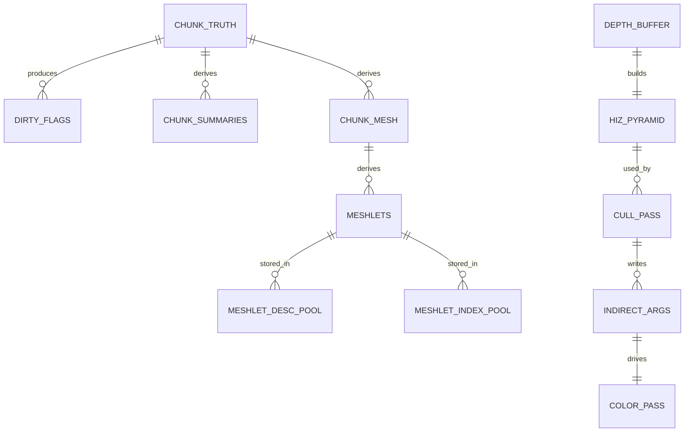

# Nanite-like Virtualized Geometry for Voxel Engines, Refined for Your Vault

## Executive summary

No, the earlier work wasn’t “lost”—it was directionally correct but didn’t reflect that your vault already **fully specifies** the Hi‑Z chain (R‑2→R‑5), the edit dirty/compaction/version-swap protocol, and the GPU chunk-pool allocator. This follow‑on report treats those as **baseline designs already done on paper** and focuses the “deep research” lens on the **one real design gap your assessment surfaced: sub‑chunk surface clustering (meshlets) for finer-grained GPU visibility selection**.

The transferable Nanite primitives remain: **GPU-driven cluster visibility, hierarchical occlusion (HZB/Hi‑Z), small cluster metadata, indirect submission, and streaming/page residency**—not “microtriangles.” Epic explicitly positions Nanite as a *virtualized geometry system* with a compressed internal format, fine-grained streaming, and automatic LOD that “does work on only the detail that can be perceived.” citeturn1search5turn8search37

For voxel/volume engines, the closest “Nanite‑philosophy” lineages are:

- **GigaVoxels**: view/occlusion dependent adaptive voxel representation + **ray-guided streaming where rendering drives data production**. citeturn2search10  
- **Efficient Sparse Voxel Octrees (ESVO)**: compact GPU-friendly sparse surface voxels + fast ray casts; technical report expands on memory/disk management and construction. citeturn0search0turn0search1  
- **GVDB / NanoVDB**: GPU-resident sparse volume structures emphasizing **pool allocation, portable layout, traversal metadata**, and practical constraints around updates. citeturn2search2turn2search0  
- **Aokana (2025)**: a modern GPU-driven voxel framework (SVDAG + LOD + streaming) with a compute-heavy pipeline that includes **Hi‑Z occlusion** and visibility-buffer style depth resolution; it explicitly targets open-world scale and integrates with mesh methods. citeturn6view0turn12search0  
- **Recent SVDAG work (2024–2025)**: stronger compression (transform-aware DAGs) and—critically—**GPU-side editing of compact voxel representations using dynamic GPU hash tables**, directly relevant to “fully GPU-driven edits” discussions. citeturn12search45turn12search5  

**What’s new and useful for your next architectural step** is the meshlet tier: how to subdivide a single chunk mesh into **subchunk meshlets**, assign robust bounds/cones, integrate meshlet culling into your existing R‑2→R‑5 visibility product, and keep it edit-friendly with your existing version/dirty machinery.

**Prioritized primary/official sources (copy/paste links)**  
```text
Epic Nanite docs: https://dev.epicgames.com/documentation/unreal-engine/nanite-virtualized-geometry-in-unreal-engine
Nanite deep dive slides (SIGGRAPH 2021): https://advances.realtimerendering.com/s2021/Karis_Nanite_SIGGRAPH_Advances_2021_final.pdf
Ubisoft GPU-driven pipelines (SIGGRAPH 2015): https://advances.realtimerendering.com/s2015/aaltonenhaar_siggraph2015_combined_final_footer_220dpi.pdf
Greene/Kass/Miller HZB paper (1993): https://www.cs.princeton.edu/courses/archive/spring01/cs598b/papers/greene93.pdf
GigaVoxels project page: https://www-sop.inria.fr/reves/Basilic/2009/CNLE09/
ESVO (NVIDIA): https://research.nvidia.com/publication/2010-02_efficient-sparse-voxel-octrees
GVDB (EG HPG 2016): https://diglib.eg.org/items/38f63830-8a80-4b96-9c16-65e7186feaa2
NanoVDB (NVIDIA SIGGRAPH 2021 Talks): https://research.nvidia.com/labs/prl/publication/nanovdb/
Aokana (arXiv abs): https://arxiv.org/abs/2505.02017
Meshlet generation strategies (JCGT 2023): https://jcgt.org/published/0012/02/01/paper-lowres.pdf
Mesh shader spec (DirectX): https://microsoft.github.io/DirectX-Specs/d3d/MeshShader.html
Conservative meshlet bounds (CGF 2021): https://www.cg.tuwien.ac.at/research/publications/2021/unterguggenberger-2021-msh/
Transform-aware SVDAGs (authors’ PDF): https://publications.graphics.tudelft.nl/papers/810
Editing compact voxel reps on GPU (EG 2024): https://diglib.eg.org/items/ffd7acf6-01f7-4e53-87f8-4cded382c944
```

## Survey of Nanite-like ideas applied to voxel and volume systems

### Virtualization where visibility drives residency
GigaVoxels is the cleanest conceptual match to Nanite’s “virtualize geometry like textures” pitch: it uses an adaptive voxel structure that depends on **view and occlusion** and explicitly “guides data production and streaming” from information “extracted during rendering.” citeturn2search10  
This is philosophically identical to Nanite’s working-set approach; the primitive differs (voxels + ray casting vs cluster rasterization).

### Sparse hierarchies for surfaced voxels (SVO/SVDAG lineage)
ESVO shows how to use sparse voxel hierarchies as a **generic, feature-rich geometry representation on GPUs**, including compact storage and efficient ray casts; it also introduces contour and normal encoding methods and discusses practical barriers. citeturn0search0turn0search1  
Aokana then modernizes the SVDAG track for open worlds: it claims a GPU-driven pipeline, LOD, streaming, and large-scale rendering; the arXiv abstract explicitly highlights **real-time rendering at tens of billions of voxels** and integration with mesh-based methods. citeturn6view0turn12search0

The 2025 “Transform‑Aware SVDAG” work improves compression by exploiting transformations (symmetries/translations) and introduces pointer encoding to reduce memory—valuable if you ever adopt a far-field DAG store. citeturn12search45turn12search4

### GPU-native data management and update semantics
GVDB frames the sparse volume problem as requiring **dynamic topology** over large domains and proposes an indexed memory pooling design and hierarchical traversal for GPU ray tracing. citeturn2search2  
NanoVDB emphasizes a portable GPU-friendly sparse volume structure widely used in production tools, and its core value proposition is: *layout + metadata make GPU traversal practical at high resolution.* citeturn2search0

Crucially, newer research directly targets the “edits on compact representations” bottleneck: **Editing Compact Voxel Representations on the GPU (2024)** explicitly states that real-time editing of high-resolution SVDAG scenes is challenging and proposes GPU-side editing enabled by dynamic GPU hash tables, enabling large operations like painting at real-time frame rates. citeturn12search5  
This is directly relevant to your broader “GPU-world drives itself” direction—even if your canonical truth remains chunked occupancy, this paper is a key reference if you later introduce a DAG-based far-field or compression tier.

### GPU-driven visibility and hierarchical occlusion as a reusable primitive
The Ubisoft GPU-driven pipeline talk is the canonical production reference for: **indirect dispatch/multidraw**, cluster/mesh-level culling, and occlusion depth/HZB integration without heavy CPU intervention. citeturn5search36turn1search1  
The foundational HZB paper (Greene/Kass/Miller 1993) is still conceptually relevant: it combines object-space subdivision with an image-space Z pyramid and exploits temporal coherence—exactly the logic modern Hi‑Z implementations still echo. citeturn13search22

## Meshlets for voxel surfaces: techniques and what research says

Your vault gap is not “how to do Hi‑Z” or “how to do versioned dirty swap”—it’s **how to introduce a sub‑chunk surface cluster tier** so culling granularity is smaller than one chunk draw.

### What “meshlets” buy you in a voxel engine
A meshlet tier primarily improves **Product 3 (camera-visibility structure)**: it reduces *triangle setup/raster* work for partially visible or partially occluded chunks by letting the GPU reject large subsets before issuing triangles.

This is exactly the granularity jump Nanite exploits: small clusters with bounds, culled via frustum/occlusion/backface proxies, then submitted via GPU-driven lists. citeturn8search37turn5search36

### Meshlet generation quality matters
The JCGT 2023 paper on meshlet generation strategies makes two points that matter for voxel meshes too:

- meshlet collections with poor fill/uniformity can degrade performance (more meshlets, more overhead),
- there is a nuanced trade: strive for cullable meshlets, but “not at the cost of a too big increase in meshlet collection size.” citeturn11search35  

This maps directly to voxel surfaces: if you over-split chunks into tiny meshlets, you increase descriptor/culling overhead and indirect args size; if you under-split, you don’t fix overdraw.

### Conservative bounds and “normal cone” metadata
Even though voxel chunk surfaces are static (vs skinned), the meshlet bounds literature is still valuable because it formalizes robust cluster metadata:

- conservative spatial bounds,
- normal distribution cones for backface-ish culling,
- practical considerations for fine-grained culling correctness. citeturn10view0turn10view1  

For voxel meshlets, conservative bounds are much simpler than for animated meshes, but the *conceptual takeaway* is important: **cluster bounds must never cull visible primitives**; false positives are okay, false negatives are corruption.

### Mesh shaders are optional but shape the “ideal” data layout
The DirectX mesh shader specification explicitly states that mesh shaders require geometry to be separated into compressed batches (“meshlets”) and highlights the ability to cull/amplify geometry with a compute-like model and indirect dispatch support. citeturn3search0  
Even if your target API/platforms remain unspecified, this document is a good “north star” for the meshlet abstraction: a meshlet is a batch with compact indices and bounded vertex/primitive output.

## Integrating meshlets into your existing R‑2→R‑5 visibility chain

Your vault already defines a clean separation of products: world-space traversal (Product 1), surface structure (Product 2), and camera visibility (Product 3). That separation is aligned with PBRT’s view that DDA/grid traversal is a distinct concern from raster visibility; PBRT even uses DDA stepping as a core iterator for volume “majorant grids,” reinforcing the idea that traversal and raster are separate engines with different acceleration needs. citeturn7search0

### Terminology clarification: “BVH over meshlets” vs “BVH over voxels”
Your traversal doc’s rejection of “BVH over voxels” is about **Product 1**: a BVH is usually the wrong structure for *regular grid traversal / occupancy queries*, where multi-level DDA + bit/brick summaries fit better. PBRT’s DDA stepping and majorant grid illustrate why uniform/hierarchical grids excel at voxel stepping tasks. citeturn7search0  
A “BVH over meshlets” is a **Product 3** structure: it accelerates camera visibility decisions over *raster clusters*, not voxel occupancy traversal. These are different domains; the naming collision is real, but the design intent does not conflict.

### A “meshlet tier” that composes cleanly with your vault design
The clean compositional rule (consistent with Nanite and Ubisoft GPU-driven pipelines) is:

- Keep **one chunk slot** as the unit of residency and edit dirtiness (your existing design).
- Add a derived **meshlet range table per chunk slot**:
  - `meshlet_range_start[slot]`, `meshlet_range_count[slot]`
  - meshlet descriptors stored in a global pool.
- Update R‑4 occlusion culling to operate at two tiers:
  1) coarse: chunk AABB vs Hi‑Z (cheap early reject),
  2) fine: meshlet AABB vs Hi‑Z (for chunks that survive coarse culling).

This mirrors the staged culling recommended in production GPU-driven pipelines: coarse instance cull → finer cluster cull → indirect. citeturn5search36

### Data structures that fit your 64³ padded-column + palette world
A voxel-friendly meshlet contract should bias toward **rebuild locality and stable boundaries**:

- **Option S (subchunk-aligned meshlets):** meshlets correspond to fixed 8³ or 16³ subregions of a chunk. This aligns perfectly with your existing dirty_subregions idea and bounds are trivial.
- **Option A (adaptive meshlets from greedy quads):** run a meshlet builder on the chunk mesh output using JCGT-informed heuristics (vertex-complete, then primitive fill). citeturn11search35  
- **Hybrid:** start with subchunk bins, then within each bin generate meshlets to meet vertex/primitive limits.

In all cases, your palette materials suggest one extra meshlet meta choice: either allow meshlets to contain many materials (one draw path, but shader divergence) or partition meshlets by material bins (more meshlets but more coherent shading).

## Primary research and engineering questions for meshlets in an editable voxel engine

### Meshlet granularity vs overhead
Meshlet culling adds:
- descriptor memory,
- culling compute cost,
- indirect arg bandwidth.

The JCGT findings point to a real risk: meshlet collections that grow too large can reduce performance even if culling improves. citeturn11search35  
This must be measured on voxel content, not assumed.

### Meshlet generation under edits
Two distinct problems:
- **where do meshlets come from?** (subchunk fixed vs adaptive)
- **how do edits invalidate them?**

Your vault already has the right invalidation model (versioned derived artifacts). The meshlet spec should define: **meshlets are derived from the chunk’s authoritative occupancy/materials and stamped with build versions**, never written incrementally in place.

### Robust bounds and avoiding “occlusion bugs”
HZB/Hi‑Z culling assumes conservative tests; Greene’s paper emphasizes coherence and conservative visibility logic. citeturn13search22  
Meshlet bounds must be conservative in clip-space tests. For voxel meshlets, conservative AABBs are easy; the hard part is avoiding numerical/precision pitfalls in screen rect + depth comparisons.

### GPU vs CPU scheduling and debugability
This is partly solved in the vault (you already have a control-plane/data-plane separation on paper). The meshlet tier adds new failure modes:
- stuck meshlet rebuild queues,
- stale range tables,
- allocator fragmentation in meshlet pools,
- mismatched versions causing flicker.

The 2024 “Editing Compact Voxel Representations on the GPU” paper is a useful long-term reference for how quickly update semantics can dominate when pushing edits fully GPU-side, even though it targets compact DAGs rather than chunk meshes. citeturn12search5

## Three meshlet-focused experiment prototypes for your engine

These deliberately assume: **Hi‑Z + indirect draw** and **edit protocol + pool allocator** are already specified; the goal is to validate whether meshlets are worth making first-class in docs/Resident Representation.

### Subchunk-aligned meshlets
**Idea:** each 64³ chunk is partitioned into an 8×8×8 grid of subchunks; each subchunk produces its own mesh segment(s), treated as meshlets.

Implementation notes:
- Meshlet bounds are integer-aligned; range tables per chunk are stable.
- Dirty_subregions maps directly to meshlet rebuild scope.
- R‑4 cull does chunk AABB first, then meshlets scoped to surviving chunks.

Measure:
- meshlets per visible chunk,
- cull rate (meshlets rejected / tested),
- overdraw reduction vs chunk-only,
- rebuild latency per edited subregion.

Expected trade:
- best rebuild locality, potentially weaker meshlet quality (bounds not optimal if geometry sparse within a subchunk).

### Adaptive meshlets from greedy mesh output
**Idea:** run a meshlet builder on each chunk mesh using JCGT-recommended heuristics (“vertex-complete first, then primitive fill”), optionally with spatial locality constraints. citeturn11search35  

Implementation notes:
- Requires a meshlet builder (CPU worker or GPU compute).
- Meshlet count potentially lower than fixed subchunk bins.
- Bounds tighter where geometry clusters naturally.

Measure:
- meshlet count and distribution,
- bounds tightness (screen rect area / covered pixels),
- cull effectiveness,
- meshlet build cost per chunk rebuild.

Expected trade:
- better culling efficiency per meshlet at the cost of more complex rebuild logic.

### Meshlet backface proxy and conservative metadata
**Idea:** augment meshlets with a normal cone and/or conservative bounds; use this for early rejection before Hi‑Z tests to reduce memory fetch and Hi‑Z sampling.

Implementation notes:
- Static voxel surfaces make cones easy compared to skinned meshes, but conservative design matters. citeturn10view0turn10view1  
- Backface-ish proxy helps when many clusters face away but are not occluded.

Measure:
- rejection breakdown: frustum vs backface proxy vs Hi‑Z,
- false-positive rate (drawn but not contributing),
- total cost of cull pass.

Expected trade:
- small speedups when geometry is “closed-ish” and camera moves in coherent ways; minimal benefit in chaotic scenes.

## Comparison table

| Approach | Description | Edit-friendliness | Memory cost | Culling granularity | Difficulty | Best use cases |
|---|---|---:|---:|---:|---:|---|
| SVO / ESVO | Sparse voxel hierarchy for rendering/traversal; GPU-friendly layout for ray casting. citeturn0search0 | Medium | Medium–High | Node/brick | High | Ray-driven rendering, unified geometry+attributes |
| Chunk meshlets + indirect draw | Keep chunk truth; split surface mesh into meshlets; GPU culls meshlets and writes indirect args. citeturn5search36turn11search35 | High | Medium | Meshlet/subchunk | Medium–High | Reduce overdraw; scale submission; keep greedy mesh |
| Chunk Hi‑Z culling | Coarse chunk AABB vs Hi‑Z, indirect draws; classic GPU-driven visibility. citeturn13search22turn5search36 | Very high | Low | Chunk | Low–Medium | Immediate win; baseline visibility product |
| Hybrid raster + traversal | Raster for Product 2; DDA/hierarchy for Product 1 rays. PBRT shows DDA + majorants tradeoffs. citeturn7search0 | Medium | Medium | Ray dependent | Medium | GI/probes, picking, shadows |
| Nanite-like clusterization | Hierarchical clusters + GPU LOD + streaming + HZB; “work ∝ visible pixels.” citeturn8search37turn1search5 | Medium | Medium–High | Hierarchical cluster | Very high | Extreme geometric density + large working sets |

## Diagrams aligned to your vault’s layering

### Pipeline with meshlet tier inserted (Product 3 refinement)

```mermaid
flowchart TD
  A[Authoritative chunk truth\n(occupancy + palette materials)] --> B[Derived surface build\n(greedy mesh)]
  B --> C[Derived meshlet build\n(subchunk or adaptive)]
  C --> D[R-2 Depth prepass\n(depth only)]
  D --> E[R-3 Hi-Z pyramid]
  E --> F[R-4 Cull stage\nchunk AABB vs Hi-Z\nthen meshlet AABB vs Hi-Z]
  F --> G[Indirect args\n(meshlet-level)]
  G --> H[R-5 Color pass\nindirect draw]
```

### Buffer ownership map (authoritative vs derived + visibility)



## Recommended next steps, updated to match your vault reality

Because A (Hi‑Z + indirect draw) and C (edit-aware pools + version swap) are already designed, the practical “next step” is not more architecture—it's to **author a meshlet spec** and implement it incrementally.

Priority order that minimizes risk:

- Implement your already-specified R‑2→R‑5 visibility path first as baseline (chunk AABB granularity). This provides the measurement harness for everything else. citeturn13search22turn5search36  
- Add **subchunk-aligned meshlets** first (lowest complexity, best locality, aligns with dirty_subregions). Use this to validate: does sub-chunk culling materially reduce overdraw and frame time on your scenes?
- If wins are real, graduate to **adaptive meshlets** guided by JCGT heuristics and add conservative cone metadata only if profiling shows backface proxy rejection is worthwhile. citeturn11search35turn10view0  
- Treat BVHs as optional: if you need them for raster cluster selection, name them explicitly (“meshlet BVH”) to avoid conflict with traversal acceleration terminology; do not re-litigate voxel traversal decisions.

If you want, I can turn this into the exact “docs/Resident Representation/meshlets.md” style spec outline (fields, buffer layouts, rebuild invariants, and stage integration) using your vault’s canonical naming conventions.