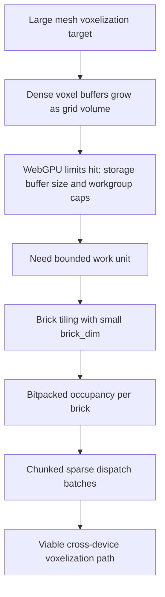
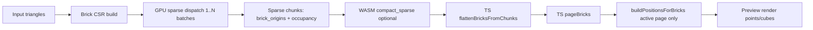
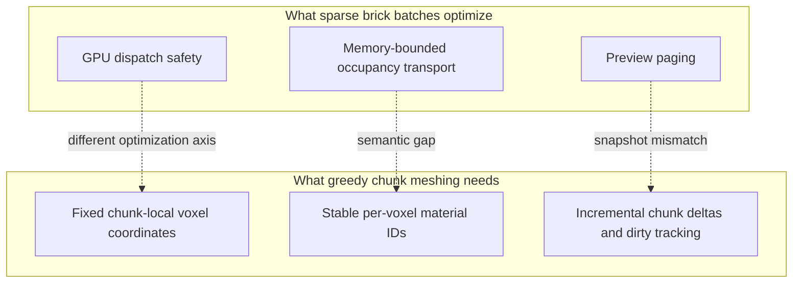

**Type:** legacy
**Status:** legacy

> **SUPERSEDED** — This document records the historical reasoning for the sparse brick output format.
> That format was the basis for Architecture A; Architecture B (GPU-compact) is the current design.
> The GPU compaction insight this document develops is what made Architecture B possible.
> Context preserved in: `philosophy.md` (brief reference), `adr/0009-architecture-b.md` (consequences).
> This file is retained as historical context only. Do not treat it as prescriptive.

---

# The Original Reasoning Behind Sparse Brick Occupancy Batches

**Date:** 2026-02-19
Status: Draft article
Audience: Rendering, voxelizer, and greedy-mesher maintainers

## Document Contract

1. Type: Descriptive/Historical (legacy rationale and constraints).
2. Primary use: Preserve intent behind sparse batching while migrating.
3. Downstream prescriptive doc:
   - `docs/greedy-meshing-docs/voxelizer-greedy-native-migration-outline.md`
4. Problem framing companion:
   - `docs/greedy-meshing-docs/voxelizer-greedy-mesher-unification-report.md`
5. Navigation hub:
   - `docs/greedy-meshing-docs/voxelizer-greedy-program-map.md`

## 1. Executive thesis

Sparse brick occupancy batches were originally chosen as a survival strategy for WebGPU-era limits, not as an ideal long-term world representation.

At the time, the system needed to voxelize large triangle meshes without allocating dense per-voxel GPU buffers that exceeded device limits. The brick+batch format gave us a way to:

1. Keep GPU storage bounded per dispatch.
2. Encode occupancy compactly with bitpacking.
3. Process very large scenes incrementally.
4. Feed interactive debug/preview render paths without crashing on large allocations.

This design solved the immediate voxelization and preview bottleneck. It also introduced the integration gap we now see with chunk-native greedy meshing.

## 2. The original pressure: dense buffers were not viable at scale

The early rendering/preview path was directly exposed to buffer-size failures. We have a concrete historical symptom in the debug report:

1. Large voxel renders produced buffer allocations in the hundreds of MB range.
2. WebGPU buffer limits were exceeded (`bufferSize ... exceeds max buffer size`).
3. The engine had to split work into smaller units to continue rendering.

Reference: `docs/greedy-meshing-docs/instanced-mesh-chunking-debug-report.md:5` and `docs/greedy-meshing-docs/instanced-mesh-chunking-debug-report.md:15`.

In parallel, the voxelizer itself had to respect hard device limits:

1. Workgroup invocations.
2. Max storage buffer binding size.
3. Max compute workgroups per dimension.

Reference: `crates/voxelizer/src/gpu/mod.rs:130`, `crates/voxelizer/src/gpu/mod.rs:136`, `crates/voxelizer/src/gpu/mod.rs:138`.

This is the core origin story: sparse brick occupancy batches were the representation that fit inside these constraints while still being GPU-first.

## 3. Why "brick" granularity was selected

The voxelizer derives `brick_dim` from GPU limits, then clamps it to a small bounded range:

1. `brick_dim` is based on cube root of max workgroup invocations.
2. It is clamped to `[2, 8]`.

Reference: `crates/voxelizer/src/gpu/mod.rs:140` and `crates/voxelizer/src/gpu/mod.rs:141`.

This gave a few important properties:

1. Small, predictable local voxel domains per tile.
2. Stable occupancy word sizing per brick (`words_per_brick`).
3. A natural unit for sparse scheduling and per-brick triangle candidate lists.

In other words, brick size was not arbitrary; it was directly shaped by GPU hardware execution constraints.

## 4. Why occupancy bitpacking was central

The sparse output structure encodes:

1. `brick_origins`: where non-empty bricks live.
2. `occupancy`: bitpacked occupancy payload.
3. Optional per-voxel attributes (`owner_id`, `color_rgba`).

Reference: `crates/voxelizer/src/core.rs:143`.

Occupancy bitpacking was crucial because it reduced storage pressure dramatically compared to scalar-per-voxel occupancy:

1. 32 occupancy voxels per `u32` word.
2. Bounded per-brick occupancy buffer sizes.
3. Better dispatch feasibility under storage binding limits.

The code path reinforces this everywhere by calculating brick voxel count and words per brick before allocation and readback.

Reference: `crates/voxelizer/src/gpu/sparse.rs:154`, `crates/voxelizer/src/gpu/sparse.rs:155`, `crates/wasm_voxelizer/src/lib.rs:36`, `crates/wasm_voxelizer/src/lib.rs:37`.

## 5. Why "batches" (chunked sparse outputs) were necessary

Sparse alone was not enough. Large inputs could still exceed single-dispatch limits. The voxelizer therefore added chunked sparse execution:

1. Compute max bricks per dispatch from storage/workgroup limits.
2. Choose chunk size (`auto` or capped requested size).
3. Process bricks in multiple dispatch batches.

Reference: `crates/voxelizer/src/gpu/mod.rs:228`, `crates/voxelizer/src/gpu/sparse.rs:30`, `crates/voxelizer/src/gpu/sparse.rs:82`, `crates/voxelizer/src/gpu/sparse.rs:98`.

This was the key practical innovation: treat sparse bricks as a stream of bounded batches so the GPU never had to ingest the full sparse world in one pass.

## 6. Dataflow that made the design practical

The end-to-end path was intentionally modular:

1. GPU sparse voxelization emits brick occupancy chunks.
2. WASM returns chunk arrays and can compact out empty bricks.
3. TypeScript flattens bricks, pages them, and expands positions only for active pages.

References:

1. `crates/wasm_voxelizer/src/lib.rs:764`
2. `crates/wasm_voxelizer/src/lib.rs:815`
3. `packages/voxelizer-js/src/index.ts:312`
4. `packages/voxelizer-js/src/index.ts:336`
5. `packages/voxelizer-js/src/index.ts:351`
6. `apps/web/src/modules/wasmVoxelizer/runCore.ts:116`
7. `apps/web/src/modules/wasmVoxelizer/runCore.ts:124`
8. `apps/web/src/modules/wasmVoxelizer/runCore.ts:125`
9. `apps/web/src/modules/wasmVoxelizer/runCore.ts:130`

The critical point: the system avoided eager dense expansion. It only materialized explicit voxel positions when preview/render needed them.

## 7. Safety nets that reveal the original design intent

Two details make the historical intent explicit:

1. Dense CPU fallback has an explicit size cap (`MAX_FALLBACK_BYTES = 512 MB`) before allowing fallback.
2. Sparse compaction can remove empty bricks after chunk processing.

References: `crates/wasm_voxelizer/src/lib.rs:123`, `crates/wasm_voxelizer/src/lib.rs:791`, `crates/wasm_voxelizer/src/lib.rs:815`, `crates/wasm_voxelizer/src/lib.rs:881`.

These are not "nice to have" utilities. They are defensive features for memory viability under unpredictable content and device limits.

## 8. What problem this solved well

Sparse brick occupancy batches were excellent for:

1. GPU-friendly voxelization throughput.
2. Bounded memory per dispatch.
3. Streaming/paging for debug and preview.
4. Cross-device survivability with variable WebGPU limits.

Given the constraints at the time, this was a strong and rational architecture decision.

## 9. Why the same design now creates friction with greedy meshing

The format optimized voxelization and preview, but greedy meshing wants chunk-authoritative world state:

1. Fixed chunk dimensions and padded boundaries.
2. Stable per-voxel material IDs.
3. Incremental chunk updates/deltas over time.

Sparse bricks are a mismatch for that target because conversion is required at boundaries, material semantics differ, and snapshot-style outputs lose update locality.

Reference: `docs/greedy-meshing-docs/adr/0005-voxelizer-to-mesher-integration.md:20` and `docs/greedy-meshing-docs/adr/0005-voxelizer-to-mesher-integration.md:55`.

## 10. Bottom line

The original reasoning behind sparse brick occupancy batches was correct for its original mission:

1. Fit voxelization into real GPU limits.
2. Avoid catastrophic dense allocations.
3. Keep rendering and debugging operable on large scenes.

As we standardize on greedy mesh chunk rendering, the right interpretation is not that sparse bricks were wrong. They were a successful optimization for a different boundary of the pipeline. The current task is to preserve their throughput advantages while shifting the primary interface to chunk-native, material-stable, incremental data contracts.

## 11. Visualizations

### 11.1 Constraint cascade that produced sparse brick batching

### 11.2 Sparse brick batch dataflow (implemented path)

### 11.3 Why it now conflicts with greedy chunk meshing

